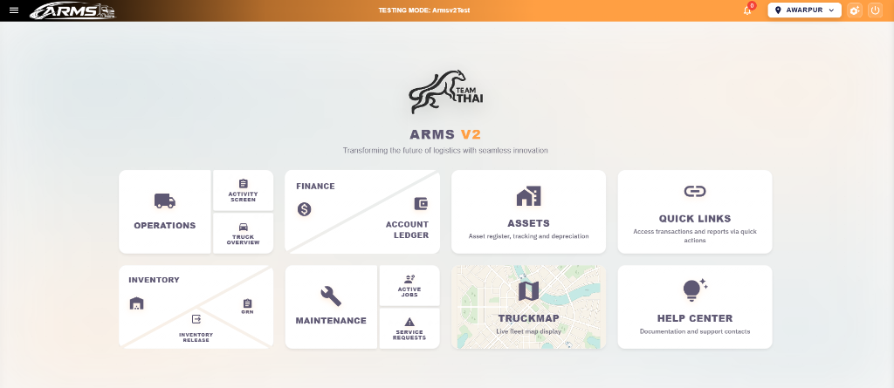
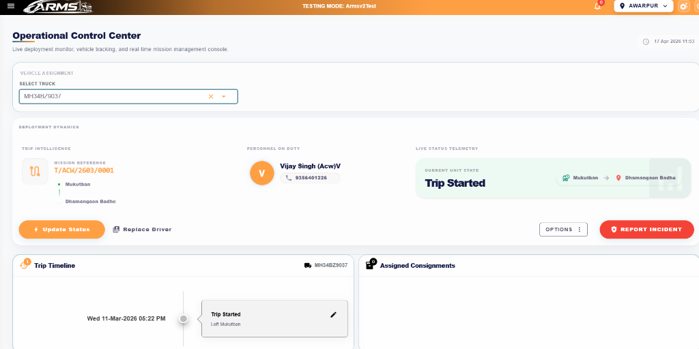
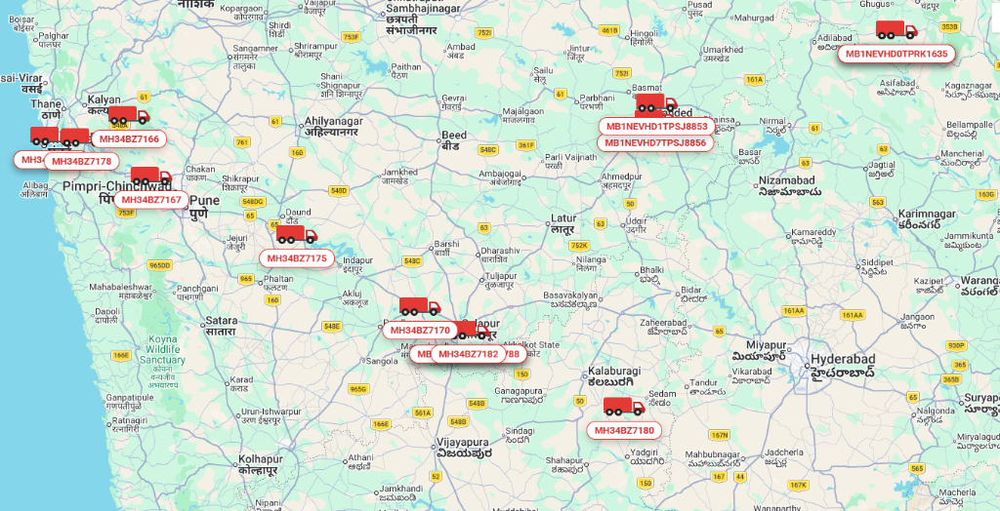
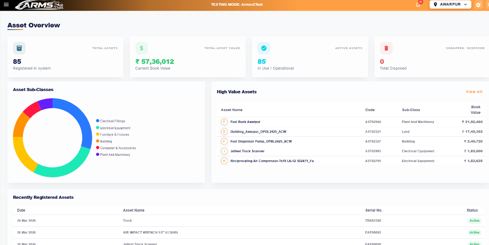
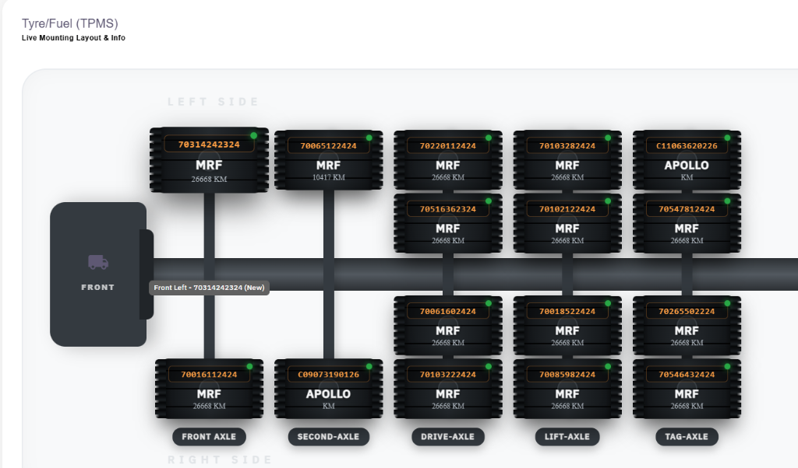

# ARMS V2 - Advanced Resource & Management System



> **"Transforming the future of logistics with seamless innovation."**

ARMS V2 is a comprehensive, enterprise-grade logistics and fleet management platform designed to provide real-time visibility, operational control, and financial management for large-scale logistics operations.

## 🚀 Key Modules

### 🛠️ Operational Control Center
Live deployment monitor and real-time mission management console. Track every trip, driver, and consignment with millisecond precision.
*   **Live Trip Intelligence**: Monitor active trips with real-time status telemetry.
*   **Personnel Management**: Drill down into driver assignments and on-duty status.
*   **Mission Timelines**: Visual chronological tracking of trip events.



### 🗺️ Live Fleet Tracking (TruckMap)
Interactive, real-time map display of the entire fleet.
*   **Global Positioning**: Instant location updates for all trucks.
*   **Status Indicators**: At-a-glance identification of vehicle health and trip progress.



### 📊 Asset & Inventory Management
Comprehensive asset registry with integrated tracking and depreciation logic.
*   **Asset Analytics**: Donut chart visualizations of asset sub-classes.
*   **Financial Tracking**: Live monitoring of "Current Book Value" and registered assets.
*   **Inventory Control**: Seamless management of Inventory Releases and GRN (Goods Received Notes).



### 🛞 TPMS (Tyre Pressure Monitoring System)
Advanced visual mounting layout for fleet maintenance.
*   **Axle-Level Detail**: Track tire brands (MRF, Apollo), serial numbers, and mileage across all axles (Front, Drive, Lift, Tag).
*   **Maintenance Alerts**: Integrated with the Maintenance module for service requests.



### 💰 Finance & Maintenance
*   **Account Ledgers**: Integrated financial reporting and account management.
*   **Service Requests**: Real-time maintenance job tracking and active job monitoring.

---

## 🛠️ Tech Stack

- **Backend**: .NET 8/10 Core Web API (Modular Monolith architecture)
- **Frontend**: Blazor WebAssembly / Server (Admin Dashboard)
- **Database**: SQL Server
- **Background Workers**: .NET Worker Services for Telemtics and GPS Integration
- **Reporting**: SSRS (SQL Server Reporting Services) / RDL

---

## ⚙️ Getting Started

### Prerequisites
- [.NET SDK 8.0+](https://dotnet.microsoft.com/download)
- [SQL Server](https://www.microsoft.com/en-us/sql-server/sql-server-downloads)
- [Visual Studio 2022](https://visualstudio.microsoft.com/)

### Setup
1. Clone the repository:
   ```bash
   git clone https://github.com/mkrijas/ARMS.v2.git
   ```
2. Configure the database in `appsettings.json` within the `ARMS.v2` project:
   ```json
   "ConnectionStrings": {
     "DefaultConnection": "Server=YOUR_SERVER;Database=ARMSV2;Trusted_Connection=True;"
   }
   ```
3. Run migrations or setup the database using provided scripts.
4. Launch the solution:
   ```bash
   dotnet run --project ARMS.v2
   ```

---

## 📄 License
This project is licensed under the MIT License - see the [LICENSE](LICENSE) file for details.

